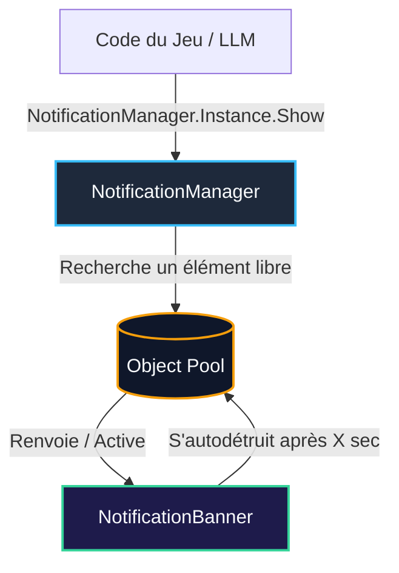

# 📋 Plan d'Implémentation : Système de Notifications (NotificationManager)

Ce plan décrit l'implémentation d'un système de notifications robuste, optimisé pour les performances (Object Pooling, Capped Queue) et visuellement aligné sur notre direction esthétique **"Gilded Codex"** (fond `#1B1106` semi-transparent avec contour brillant et ombres portées).

---

## 🎯 Objectifs de l'Implémentation

1.  **Esthétique Gilded Codex** : Arrière-plan `#1B1106` avec opacité à ~70% (Alpha 180), liseré lumineux doré/blanc, et ombre portée diffuse. Zéro shader requis.
2.  **Object Pooling Obligatoire (Performance)** : Éliminer les allocations régulières de Garbage Collector (GC) causées par l'affichage répétitif des répercussions de dialogues LLM ou d'événements.
3.  **Gestion de File d'Attente Capped (Max 3)** : Limiter l'affichage simultané à 3 bannières à l'écran. Si de nouvelles notifications surviennent alors que la file est pleine, les plus anciennes non encore affichées sont éliminées pour éviter l'encombrement visuel.
4.  **Support du Type `Warning`** : Distinguer clairement les erreurs système de coroutines ou d'API Groq (en rouge `#EF4444`) des autres types neutres.

---

## 📐 Architecture Technique

### 📁 Emplacements des Fichiers
*   `[NEW]` [NotificationType.cs](file:///c:/Users/lenovo/HlaikiPolished/Assets/Scripts/Ui/NotificationType.cs) : L'énumération des types.
*   `[NEW]` [NotificationBanner.cs](file:///c:/Users/lenovo/HlaikiPolished/Assets/Scripts/Ui/NotificationBanner.cs) : Contrôle individuel d'une bannière (animations de fondu, couleur de thème, recyclage vers le pool).
*   `[NEW]` [NotificationManager.cs](file:///c:/Users/lenovo/HlaikiPolished/Assets/Scripts/Ui/NotificationManager.cs) : Singleton gestionnaire de la file d'attente globale et du pool de bannières.

---

## 🛠️ Détail des Composants



### 1. `NotificationType` (Enum)
```csharp
public enum NotificationType
{
    Friendship,  // Vert Émeraude (#10B981) - Gain d'amitié
    Reputation,  // Indigo (#6366F1) - Progression globale
    Fragment,    // Doré (#F59E0B) - Fragments d'histoire découverts
    System,      // Gris Slate (#94A3B8) - Infos neutres
    Warning      // Rouge Alerte (#EF4444) - Crashs coroutines, erreurs API
}
```

### 2. `NotificationBanner.cs` (Contrôleur de Jeton UI)
*   Expose des références vers `TextMeshProUGUI` (Titre, Description), `Image` (Background, Icône), et `CanvasGroup` (pour le fondu alpha).
*   **Aesthetics "Gilded Codex"** : Applique une couleur de fond fixe `#1B1106` avec Alpha 180. Ajuste la couleur de l'icône ou de la bordure latérale selon le `NotificationType`.
*   Contient sa propre Coroutine d'animation :
    1.  *Fade-In* progressif du `CanvasGroup.alpha` de `0` à `1`.
    2.  Attente de la durée définie (ex: 3 secondes).
    3.  *Fade-Out* de `1` à `0`.
    4.  Appel de retour : signale au `NotificationManager` qu'il est libre pour réutilisation (remis dans le Pool et désactivé).

### 3. `NotificationManager.cs` (Le Gestionnaire central)
*   **Singleton** persistant (`Instance`).
*   **Pooling** :
    *   Au démarrage (`Awake`), pré-génère une liste de `NotificationBanner` (ex: 5 bannières) désactivées et les stocke sous un parent UI invisible ou les laisse inactives.
    *   Lorsqu'une notification est appelée, recherche une bannière inactive. Si aucune n'est disponible (extrêmement rare si capped à 3), en instancie une nouvelle pour agrandir dynamiquement le pool.
*   **Capping & Queue** :
    *   Maintient une `Queue<NotificationData>` des notifications en attente de traitement.
    *   Garde une liste des bannières actuellement visibles (max 3).
    *   Si la file d'attente dépasse son cap (ex: 5 en attente alors que 3 sont déjà à l'écran), supprime automatiquement la plus ancienne non visible (*silent drop*) pour éviter d'inonder le joueur de notifications en retard.

---

## 🎨 Design Visuel de la Bannière (Aesthetics)
La bannière sera construite sur un UI `Image` avec :
*   **Couleur de fond** : `#1B1106B4` (RGBA: 27, 17, 6, 180) - un marron chocolat doré sombre, semi-transparent.
*   **Bordure latérale décorative** : Une fine bande colorée sur la gauche qui change de couleur selon le `NotificationType` pour une lisibilité instantanée.
*   **Contour brillant** : Un liseré fin or/blanc translucide pour faire ressortir la bannière de la scène 3D.
*   **Ombre portée** : Composant `Shadow` ou pré-rendu pour ancrer visuellement l'élément au-dessus du jeu.

---

## 🧪 Plan de Vérification

### 1. Tests Unitaires & Intégration
*   Nous créerons un petit script de débogage temporaire `NotificationTestTrigger.cs` attaché à un bouton ou à des touches clavier (F1 pour Amitié, F2 pour Fragment, F3 pour Warning) pour tester l'empilement, le recyclage par pool, et le cap de la file d'attente.
*   Validation visuelle par l'utilisateur ou par capture d'écran.

### 2. Robustesse
*   **Spam Test** : Lancer 15 notifications d'affilée en une frame. Le système doit afficher exactement les 3 premières, mettre en cache les 2 suivantes, éliminer silencieusement les 10 autres obsolètes, et recycler les bannières au fur et à mesure sans générer d'allocation mémoire (`new GameObject`).
