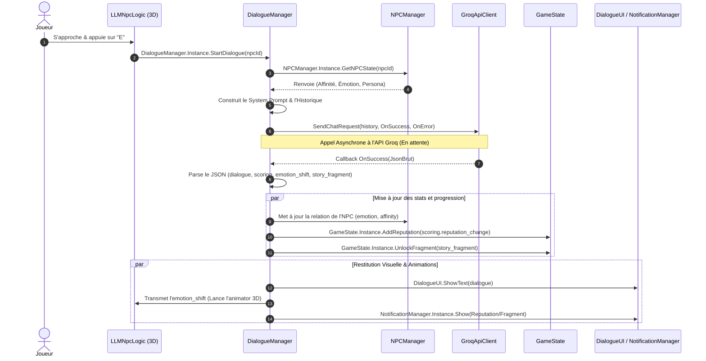

# 🧠 Guide d'Intégration & Architecture d'Appels LLM (NPC Interaction)

Ce guide détaille comment intégrer la logique de simulation narrative située dans `HlaikiSim_data/logic organisation/` au sein de notre projet principal. Il spécifie la responsabilité de chaque script, les points de terminaison (*endpoints*) et le flux d'appels exact entre les composants pour les interactions LLM.

---

## 🏗️ 1. Principe de Responsabilité Unique (SRP)

Pour maintenir un code propre et facilement maintenable, chaque composant gère une **unique responsabilité** et collabore avec les autres via des Singletons.

```
┌────────────────────────────────────────────────────────────────────────┐
│                        Espace 3D / Physique                            │
│   [LLMNpcLogic] (Gère la proximité, déclenche l'interaction 3D)         │
└───────────────────┬────────────────────────────────────────────────────┘
                    │ 1. StartDialogue()
                    ▼
┌────────────────────────────────────────────────────────────────────────┐
│                        Moteur Narrative / Logique                      │
│   [DialogueManager] (Orchestre la discussion, construit les prompts)    │
└───────┬───────────────────┬──────────────────────┬─────────────────────┘
        │ 2. Get State      │ 3. Send HTTP Request │ 4. Update Stats
        ▼                   ▼                      ▼
┌──────────────┐    ┌──────────────┐       ┌──────────────┐
│  NPCManager  │    │GroqApiClient │       │  GameState   │
│(Base NPCs)   │    │(Réseau Groq) │       │(Rep/Secrets) │
└──────────────┘    └──────────────┘       └──────────────┘
```

### 📋 Descriptif des Classes & Responsabilités

| Script C# | Responsabilité Unique | Dépendances Directes (Appels sortants) |
| :--- | :--- | :--- |
| **`LLMNpcLogic.cs`** | **Physique 3D & Détection** : Gère la détection de proximité du joueur, écoute la touche d'action (E), déclenche l'UI et demande au `DialogueManager` de lancer le dialogue. | `DialogueManager.Instance` |
| **`DialogueManager.cs`** | **Orchestrateur Narratif** : Gère le flux de discussion, compile le prompt (historique + persona + contexte), appelle l'API via `GroqApiClient` et traite la réponse JSON (dialogue + scoring). | `GroqApiClient.Instance`, `NPCManager.Instance`, `GameState.Instance`, `NotificationManager.Instance` |
| **`NPCManager.cs`** | **Base de Données NPCs** : Charge les fichiers personas JSON au démarrage et maintient les instances de `NPCState` (statuts relationnels individuels). | `NPCState`, `NPCPersonaData` |
| **`GroqApiClient.cs`** | **Client Réseau Bas-Niveau** : Se charge exclusivement d'envoyer la requête HTTP POST à l'API de Groq en asynchrone et renvoie le JSON brut. | *Aucune* (Complètement découplé) |
| **`GameState.cs`** | **Sauvegarde & Progression** : Gère et persiste la réputation globale du joueur et la liste des fragments de secrets découverts. | `SessionManager.Instance` |
| **`EventTracker.cs`** | **Réactions Systémiques** : Écoute les événements du jeu (ex: donner une pièce) et ajuste directement les relations dans `NPCManager` en dehors des dialogues. | `NPCManager.Instance` |

---

## 🔄 2. Flux d'Appels & Endpoints (Le Cycle d'une Interaction)

Voici le parcours exact d'une interaction, de l'appui sur la touche physique jusqu'à la notification de répercussion.

### 📶 Diagramme de Séquence des Appels LLM



---

## 🛠️ 3. Spécification des Endpoints (Comment les connecter)

Voici comment raccorder précisément les méthodes clés dans tes scripts pour conserver l'architecture SRP :

### 1️⃣ Déclenchement de la discussion (`LLMNpcLogic.cs`)
Dans le script physique 3D, au moment où le joueur interagit :
```csharp
// DANS LLMNpcLogic.cs
private void Interact()
{
    // 1. Désactiver les contrôles de mouvement physiques si nécessaire (via Events)
    
    // 2. Lancer la logique narrative globale
    DialogueManager.Instance.StartDialogue(this.npcId);
}
```

### 2️⃣ Récupération de l'état narratif (`DialogueManager.cs`)
Au début de `StartDialogue`, récupère les informations stockées par `NPCManager` pour nourrir le prompt :
```csharp
// DANS DialogueManager.cs
public void StartDialogue(string npcId)
{
    NPCState state = NPCManager.Instance.GetNPCState(npcId);
    NPCPersonaData persona = NPCManager.Instance.GetPersona(npcId);
    
    // Construction du prompt enrichi avec la réputation du joueur
    int currentRep = GameState.Instance.PlayerReputation;
    string prompt = CompilePrompt(persona, state, currentRep);
    
    // Lancer la requête HTTP
    StartCoroutine(GroqApiClient.Instance.SendChatRequest(history, 
        onSuccess: (jsonResponse) => HandleDialogueResponse(npcId, jsonResponse),
        onError: (err) => HandleDialogueError(err)
    ));
}
```

### 3️⃣ Traitement du retour JSON fusionné (`DialogueManager.cs`)
C'est ici que s'effectue la distribution des responsabilités après l'appel API :
```csharp
// DANS DialogueManager.cs
private void HandleDialogueResponse(string npcId, string rawJson)
{
    // 1. Parser la réponse de l'IA (format fusionné unique)
    DialogueResponse response = JsonUtility.FromJson<DialogueResponse>(rawJson);

    // 2. Diffuser les données aux responsables
    
    // Responsable Relation : NPCManager
    NPCManager.Instance.UpdateRelationship(npcId, response.scoring.affinity_change, response.emotion_shift);
    
    // Responsable Progression : GameState
    if (response.scoring.reputation_change != 0)
    {
        GameState.Instance.AddReputation(response.scoring.reputation_change);
        NotificationManager.Instance.Show(
            $"Réputation : {(response.scoring.reputation_change > 0 ? "+" : "")}{response.scoring.reputation_change}", 
            NotificationType.Reputation
        );
    }
    
    if (!string.IsNullOrEmpty(response.story_fragment))
    {
        GameState.Instance.UnlockFragment(response.story_fragment);
        NotificationManager.Instance.Show("Fragment d'histoire découvert !", NotificationType.Fragment);
    }

    // 3. Renvoyer le texte final et l'émotion à l'UI et au corps 3D
    DialogueUI.Instance.DisplayText(response.dialogue);
    NPCManager.Instance.GetNPCInstance(npcId).PlayEmotionAnimation(response.emotion_shift);
}
```

---

## 💡 4. Règles de Simplicité pour l'Intégration
1.  **Gardez `GroqApiClient` pur** : Il ne doit jamais savoir ce qu'est un NPC, une scène Unity ou un texte TMP. Il reçoit une liste de messages, renvoie du texte. C'est tout.
2.  **Laissez l'UI passive** : Les scripts UI (`DialogueUI.cs`, `NotificationBanner.cs`) doivent uniquement recevoir des chaînes de caractères et les afficher. Ils ne prennent aucune décision logique.
3.  **Centralisez le parsing dans `DialogueManager`** : C'est le cerveau narratif. S'il y a un changement de structure dans le JSON retourné par l'IA, seul ce script devra être modifié.
