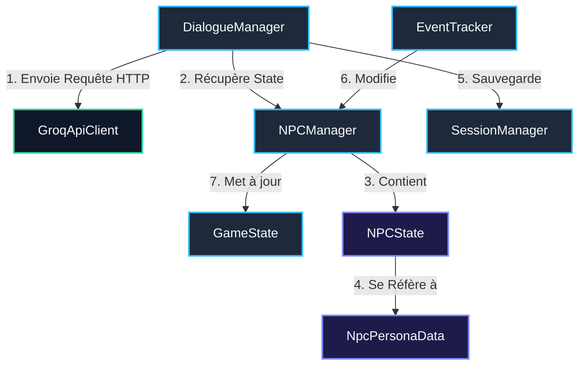

# 🛠️ Guide d'Intégration Simplifié pour l'Équipe (Backend & Simulation)

Ce guide est destiné à simplifier et guider le travail d'intégration des systèmes de simulation sociale et de dialogue dans notre projet Unity. Il repose sur nos objectifs de **clarté du code**, de **responsabilité unique (SRP)**, et de **faible couplage**.

---

## 📐 Principes d'Architecture & Bonnes Pratiques

Pour maintenir un code propre et robuste, nous suivons trois règles simples :
1.  **Responsabilité Unique (Single Responsibility Principle - SRP)** : Un script fait **une seule chose** et la fait bien. La logique réseau est séparée de la logique de discussion, qui est elle-même séparée des données de relation ou des triggers de scène.
2.  **Couplage Faible via Singletons & Actions** : Les composants ne s'appellent pas de manière rigide. Si un module a besoin d'une information d'un autre, il utilise son Singleton global (ex: `NPCManager.Instance.IsUnlocked()`) ou s'abonne à ses événements C# (`event Action`).
3.  **Namespace Commun** : Tous les scripts de la simulation doivent utiliser le namespace `JemaaGame.NPC` pour éviter les collisions de classes avec le reste du projet (caméra, contrôles du joueur).

---

## 📦 Cartographie des Scripts à Responsabilité Unique (SRP)

Voici la répartition claire et simplifiée des scripts pour notre coéquipier :



### 1. La Couche Réseau : `GroqApiClient.cs`
*   **Unique Responsabilité** : Envoyer des requêtes HTTP brutes (POST) avec un payload JSON à l'API de Groq et renvoyer la réponse textuelle brute (ou une erreur).
*   **Dépendance** : Ne dépend d'aucune logique de jeu ni de prompt.

### 2. Le Cœur Narratif : `DialogueManager.cs`
*   **Unique Responsabilité** : Gérer la conversation active. Il construit le prompt fusionné (*fused prompt*), maintient l'historique des répliques, appelle `GroqApiClient`, et parse la réponse JSON (séparation du dialogue `RESPONSE:` et du scoring `SCORING:`).
*   **Dépendance** : Appelle `GroqApiClient` pour le réseau et modifie les valeurs de `NPCState` via `NPCManager`.
*   **Communication** : Expose des événements (`event Action`) auxquels l'UI s'abonne pour afficher le texte ou animer les jauges.

### 3. Le Gestionnaire des Relations : `NPCManager.cs`
*   **Unique Responsabilité** : Gérer la liste des NPCs et stocker leurs instances de relation active (`NPCState`). Il évalue les conditions d'ouverture/fermeture et de déblocage (`IsUnlocked()`).
*   **Dépendance** : Instancie et contient des objets `NPCState`.

### 4. L'Objet d'État Local : `NPCState.cs`
*   **Unique Responsabilité** : Représenter les données dynamiques et changeantes d'un NPC spécifique (Favorabilité, Réputation, Émotion en cours, conditions satisfaites, résumé d'interaction).
*   **Dépendance** : Classe C# pure, aucune dépendance Unity MonoBehaviour.

### 5. Les Actions du Monde : `EventTracker.cs`
*   **Unique Responsabilité** : Recevoir les notifications d'événements physiques de la scène (ex: *"le joueur a commandé un couscous"*) et modifier la favorabilité/réputation des NPCs correspondants.
*   **Dépendance** : Appelle `NPCManager` pour mettre à jour l'état relationnel du NPC concerné.

### 6. La Persistance : `SessionManager.cs`
*   **Unique Responsabilité** : Sauvegarder les objets `NPCState` au format JSON dans `StreamingAssets/npc_sessions/` et les charger au démarrage.
*   **Dépendance** : Utilise `JsonUtility`.

---

## 🛠️ Étapes Clés pour l'Intégration du Coéquipier

Pour intégrer proprement sa logique dans le projet principal, notre coéquipier doit suivre ces 4 étapes simples :

### 📥 Étape 1 : Nettoyer la double logique réseau dans `LLMNpcLogic.cs`
Dans son dossier temporaire, le coéquipier a réécrit des doubles appels réseau directs (`apiClient.SendChatRequest`) à l'intérieur de `LLMNpcLogic.cs`. C'est une duplication inutile puisque le `DialogueManager.cs` global fait déjà ce travail de manière centralisée !
*   **Ce qu'il doit faire** : Alléger `LLMNpcLogic.cs` (le script attaché au NPC 3D) pour qu'il serve simplement de pont d'interaction.
*   **Le code propre à utiliser pour l'interaction** :
    ```csharp
    protected override void Interact()
    {
        base.Interact();
        // Délègue entièrement au gestionnaire global de dialogue
        DialogueManager.Instance.StartConversation(npcId);
        
        // Active le panneau UI de dialogue
        if (dialoguePanel != null)
        {
            dialoguePanel.gameObject.SetActive(true);
        }
    }
    ```

### ⚡ Étape 2 : Connecter l'UI par Événements (Découplage UI-Backend)
Le code de dialogue ne doit pas modifier directement les éléments UI du jeu. Il doit simplement "annoncer" que quelque chose a changé, et l'UI se met à jour d'elle-même.
*   **Ce qu'il doit faire** : Dans l'UI de discussion (`DialoguePanel.cs` ou `InputHandler.cs`), s'abonner aux événements du `DialogueManager` global :
    ```csharp
    private void OnEnable()
    {
        // S'abonne aux annonces de dialogue et d'état
        DialogueManager.Instance.OnNPCResponse += DisplayResponseText;
        DialogueManager.Instance.OnLoadingChanged += ToggleLoadingSpinner;
    }

    private void OnDisable()
    {
        // Désabonnement pour éviter les fuites de mémoire
        DialogueManager.Instance.OnNPCResponse -= DisplayResponseText;
        DialogueManager.Instance.OnLoadingChanged -= ToggleLoadingSpinner;
    }
    ```

### 🏢 Étape 3 : Créer le GameObject des Singletons
Pour que tous ces gestionnaires fonctionnent, ils doivent être instanciés une fois et persister tout au long du jeu.
*   **Ce qu'il doit faire** :
    1. Dans la toute première scène (Menu Principal ou Démarrage), créer un GameObject vide nommé **`_NPC_Singletons`**.
    2. Attacher dessus les scripts suivants :
        - `SessionManager`
        - `DialogueManager` (Penser à renseigner l'API Key dans l'Inspecteur)
        - `NPCManager`
        - `GameState`
        - `EventTracker`

### 📜 Étape 4 : Corriger les Personas JSON (StreamingAssets)
Une erreur de nommage bloque le chargement automatique des configurations JSON.
*   **Ce qu'il doit faire** : Aller dans `Assets/StreamingAssets/personas/` et renommer :
    - `driss.json` ➡️ **`driss_game.json`**
    - `zahra.json` ➡️ **`zahra_game.json`**
